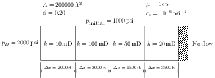

# Homework Assignment 13

## Instructions

Consider the reservoir shown below with the given properties that has been discretized into unequal grid blocks.



Extending the code you wrote for [Assignment 12](https://github.com/PGE323M-Fall2018/assignment12), add functionality to the functions `compute_transmissibility()` and `compute_accumulation()` such that they will compute interblock transmissiblities for grid blocks that could potentially differ in permeability, grid spacing, and area, as well as accumulation terms that can vary from grid block to grid block in terms of volumes and porosities.  This means that now `compute_transimilibility(i, j)` should be a function of two arguments where `i` and `j` refer to  the grid block numbers which you want to compute the transmissibility between and `compute_accumulation(i)` should also take an argument indicating the grid block number.

You should include logic in your code that checks whether the inputs given for permeability, porosity, etc. are lists (corresponding to an independent value for each grid block) or they are single valued (corresponding to constant for the entire reservoir) and handle those situations accordingly.

Use these modified functions to construct the matrices and vectors needed in the `solve_one_step()` method.  Be sure to handle boundary conditions correctly and in a way that is general enough that the boundary conditions can be change (there are tests for boundary conditions that are different from the ones shown this time).

You may continue this implementation from your `assignment12.ipynb` submission, but you must rename the file to
`assignment13.ipynb` and add it to this git repository before submission. 

## Testing

If you would like to check to see if your solution is correct, run the following commands at the Terminal command line in sequence:

```bash
>jupyter nbconvert --to python assignment13.ipynb
```

```bash
>python test.py
```
